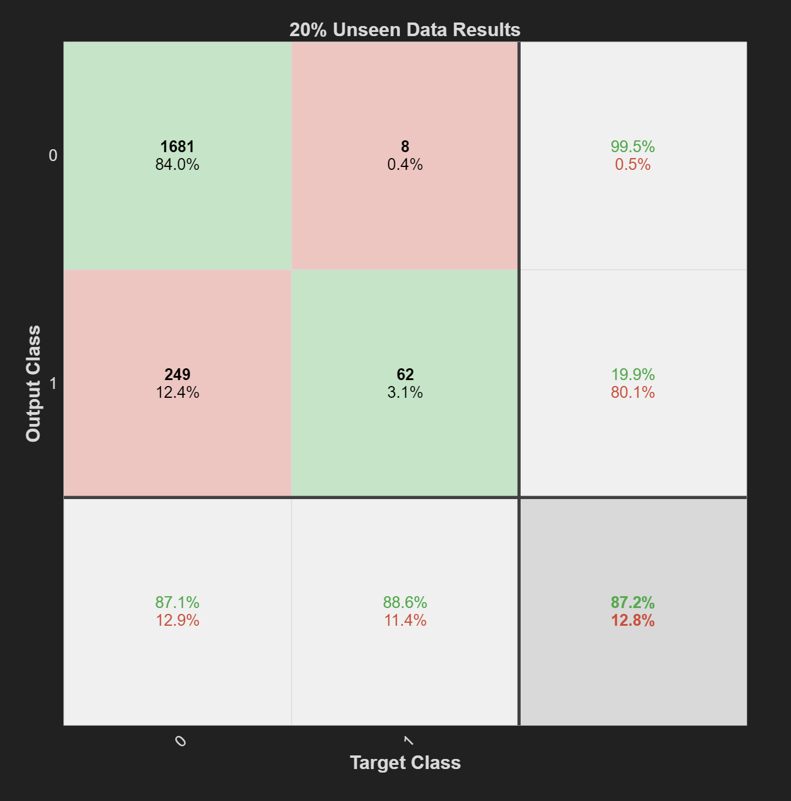
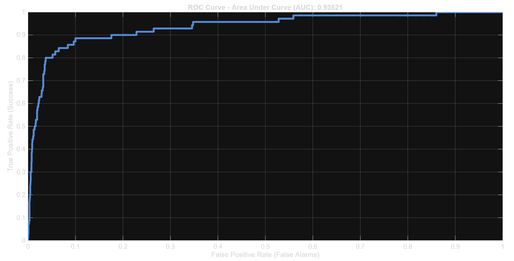

#  Industrial Predictive Maintenance via Deep Learning

This project implements a Deep Learning (Patternnet) system to predict machine failures, aimed at minimizing industrial downtime and optimizing maintenance costs. Using a professional-grade dataset, I developed a model that prioritizes factory safety and economic efficiency.

##  Key Engineering Highlights

- **Feature Engineering:** Derived custom metrics like `Power Consumption` and `Temperature Difference` from raw sensor data to better capture mechanical and thermodynamic stresses.
- **Cost-Sensitive Learning (Weighting):** Instead of simple accuracy, I implemented a **20x weight penalty** on False Negatives (Missed Failures). In a real production line (e.g., **Bosch** smart factories), missing a breakdown is significantly more expensive than a false alarm.
- **Model Architecture:** A Multi-Layer Perceptron (MLP) with a `[10 8]` hidden layer configuration, designed for high generalization and stability against noisy industrial data.

##  Performance Analysis

I used these performance metrics to verify if the model is reliable for industrial maintenance tasks.

# 1. Confusion Matrix
This matrix highlights the model's success in catching failures. By applying a heavy cost penalty, we minimized False Negatives to ensure factory safety.


# 2. ROC Curve & AUC
With an AUC score of 0.935, the system demonstrates highly reliable performance in distinguishing between normal operation and potential failure modes.


##  Project Structure
- `src/`: MATLAB source codes (`predictive_maintenance_main.m`)
- `data/`: AI4I 2020 Predictive Maintenance Dataset
- `results/`: Performance plots and visualizations

##  How to Run
To maintain a professional folder structure, the source code and data are kept in separate directories. 

**Example MATLAB path update:**
```matlab

---
### 🔍 Data Source & Acknowledgments
* **Dataset:** [AI4I 2020 Predictive Maintenance Dataset](https://archive.ics.uci.edu/ml/datasets/AI4I+2020+Predictive+Maintenance+Dataset)
* **Source:** UCI Machine Learning Repository.
* **Context:** This realistic predictive maintenance dataset is a great representation of modern Industry 4.0 challenges.
data = readtable('../data/predictive_maintenance_data.csv');
